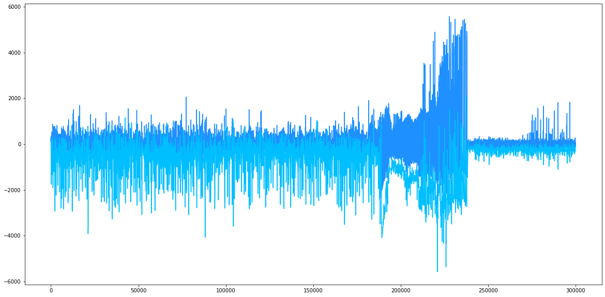
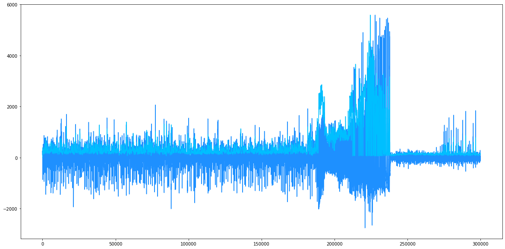
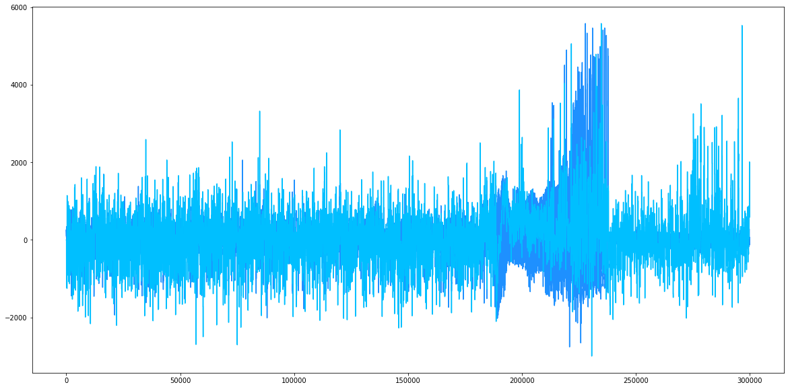

# Toward a systematic way to evaluate feature selection for iEEG analyses

## Introduction

Epilepsy is a neuro-logical disorder characterized by a recurrence of a brief abnormal and uncontrollable electrical discharge of the brain called seizure. According to World Health Organization (WHO), approximately 50 million people world- wide have epilepsy. Upon all these patients, approximately 70% are responding to prevalent cure like medications and surgeries, while 30%  are untreated or poorly treated. 

One of the promising solution to help the patients who can not control their seizures using medications and surgeries is to use implantable electrical stimulators that can monitor their brain activity and generate an electrical stimulation to stop their seizure when it is detected by the device. Different studies have shown how stimulations can help stop an occurnig seizure but in order to do so in real time in an implanted device require an efficient way of detecting when a seizure is occurring.

It is know that machine learning can help achieve this goal, and many studies have presented methods that can detect a seizure with low computational cost. However, as seizure signature can vary a lot from a patient to another and as a consequence most of those methods lacks of generalization.

In order to overcome this weakness, we will focus on one of the key component of machine learning : feature selection. Fiding the relevant feature for a given problem can often drasticly improve the performance of a model wether it's a classification or a regression task. But without a way of quantifying the quality of a given feature for a model or a patient it is hard to know if the selected feature are the best for our problem. 

The aim of this project is to present a systematic way to evaluate feature selection for iEEG analyses and to apply this method to extract insights from the SWEC-ETHZ iEEG Database.

## Dataset

The SWEC-ETHZ iEEG Database is composed of two datasets:

- **Long-term Dataset**: 2656 hours of anonymized and continuous intracranial electroencephalography (iEEG) of 18 patients with pharmaco-resistant epilepsies.
- **Short-term Dataset**: 100 anonymized intracranially recorded electroencephalographic (iEEG) datasets of 16 patients with pharmaco-resistant epilepsy.

For this study we will only focus in the first dataset (**Long-term Dataset**). The iEEG signals were recorded intracranially by strip, grid, and depth electrodes. After 16-bit analog-to-digital conversion, the iEEG signals were median-referenced and digitally band-pass filtered between 0.5 and 120 Hz using a fourth-order Butterworth filter prior to analysis and written onto disk at a rate of 512 or 1024 Hz. Forward and backward filtering was applied to minimize phase distortions. All the iEEG recordings were visually inspected by an EEG board-certified and experienced epileptologist (K.S.) for identification of seizure onsets and endings and exclusion of channels continuously corrupted by artifacts.

### Exploratory data analysis

The iEEG recordings of the 18 patients are provided into `.mat` files. Each file contains one hour of recording and the data is stored in TxM array where T is the number of iEEG electrodes and M is the number of sampling points for one hour. An additional file provided for each patients also gives informations about the sampling frequency, the beginning and the end of the seizures (in seconds).

The following table gives an idea of the duration range of the seizure for each patients in seconds. 

**We can also notice with the following table that:**

- Some patients (8, 14) have much more seizures during the recording period than overs (1,2).

- Duration of seizures from a patient to another can vary a lot ranging from (6.22s for patient 5 to 613.74s  for patient 2).
- Duration of a seizure for a given patient can vary a lot (std of patient 18 is more than 100s)

| Patient | number of seizures | mean duration | std duration | min duration | max duration |
| :-----: | :----------------: | :-----------: | :----------: | :----------: | :----------: |
|    1    |         2          |    601.787    |   16.9381    |    589.81    |   613.764    |
|    2    |         2          |    88.0625    |   2.55547    |   86.2555    |   89.8695    |
|    3    |         4          |    64.6619    |   4.14865    |   60.5449    |    68.234    |
|    4    |         14         |    41.9404    |    13.779    |   7.77257    |   68.6968    |
|    5    |         4          |    16.6878    |   0.512328   |   15.9232    |    17.013    |
|    6    |         8          |    45.8905    |   32.8707    |   29.3444    |   126.882    |
|    7    |         4          |    69.5688    |   38.6222    |   14.1287    |   98.8148    |
|    8    |         70         |    21.9668    |    53.88     |   6.22336    |   413.385    |
|    9    |         27         |    42.377     |   35.5274    |   18.7427    |   148.283    |
|   10    |         17         |    70.8471    |   10.7102    |   61.2513    |   106.262    |
|   11    |         2          |    91.5471    |   11.9259    |   83.1142    |    99.98     |
|   12    |         9          |    146.461    |   33.0413    |   106.836    |   194.754    |
|   13    |         7          |    103.004    |   60.9422    |   40.1964    |    188.44    |
|   14    |         60         |    25.8067    |   24.3826    |   6.37323    |   100.775    |
|   15    |         2          |    94.5809    |   35.5882    |   69.4163    |   119.746    |
|   16    |         5          |    190.445    |   50.6856    |   120.293    |   245.196    |
|   17    |         2          |    97.9362    |   1.28925    |   97.0246    |   98.8479    |
|   18    |         5          |    199.132    |   100.565    |   71.4387    |   300.651    |

To get a better view of the repartition of seizure duration, and the repartition of the number of seizures for each patients, we can refer to the following figures.

**Histogram of seizures duration**

<figure>
  
  

    <figcaption><bold>Figure 1.</bold> Histogram of seizure duration for all patients<figcaption>
  

</figure>

**Histogram of the number of seizure per patient**

<figure>
  
  

    <figcaption><bold>Figure 2.</bold> Histogram of the number of seizures per patitients for all patients<figcaption>
  

</figure>

In addition to the heterogeneity of the seizures between patients and for a given patient, we can also observe heterogeneity within the recordings of a given seizure depending on the electrode on which we collect the signals. The following plot shows the plot of 5 electrodes of patient 2 during a period where a seizure occurs (the seizure is highlighted in blue).

**Example of seizure signal**

<figure>
    
  

    <figcaption><bold>Figure 3.</bold> Plot of iEEG signals of patient 2 on 5 sensors during seizure 1<figcaption>
  

</figure>

This first exploration of the data gives an idea of how hard it can be to find a generalized machine learning model which is able to detect a seizure with high accuracy, low false alarm rate and with a small delay for all patients. These observations motivates us to find a way to select relevant features for each patients according to their seizure episode history in order to design a specific machine learning model which could maximize the previous metrics.

## Methods

In this part, we will present the method that we designed in order  to evaluate feature selection for iEEG analyses according to each patient. In order to do so, we will define three metrics that we will focus on. After that, we will present how those metrics were computed with different features and finally we will present the results that we obtainned with our method. As a simple start for our experiment, the classification will be based on a threshold. Seizures will be considered as detected when the value of the feature's signal is above the given threshold and as undetected if it's value is below the given threshold.

### Metrics

- **Precision:** The accuracy is defined as the number of detected seizure upon all seizures. A seizure is considered as detected if there is at least one positive classification (one of the feature value is above the given threshold) of the feature signal within the range of the seizure. This metric is important for our problem as we want to be sure that the system will detect all the seizures of the patient in order to generate a stimulation that will stop the seizure.
- **False alarm:** The False alarms are the number of points that are classified as `seizure` outside a real seizure. This metric is very important as we don't want the patient to receive a stimulation when no seizure occurs. It can be dangerous for him.
- **Delay:** The delay is defined as the number of seconds between the real beginning of a seizure and the first signal being classified as a seizure. This metric is also capital as the stimulation needs to occur as soon as possible in order to stop the seizure efficiently.

### Features

In order to extract informations from the signal during short period of time we need to compute different features. A feature is a value that we compute from a window that we shift across all the input signal. Each point of the feature signal is generated from a window of size $\texttt{window_size}$. An example is given in Figure 4.

<figure>
  

    
    <figcaption><bold>Figure 4.</bold> Feature computation example with sliding window<figcaption>
  

</figure>

### Implemented features

For now, the following features have been tested on patient 1 and 2 in order to ensure that all of the functions work correctly and are generic enough in order to be applied to the full dataset. All features are calculated using a sliding window of size  `sliding_window=128` and a step size of size `step_size=64` .

#### Min

$$
\min_{x \in [|x_0, x_0+N|]}\{y_x\}
$$

####  Max

$$
\max_{x \in [|x_0, x_0+N|]}\{y_x\}
$$

#### Energy

$$
Energy = \sum_{x=x_0}^{x_0+N} y_x^2
$$

#### Line length

Line length is defined as the running sum of the absolute differences between all consecutive samples within a predefined window. The value of this feature grows as the data sequence magnitude or signal variance increases.
$$
LineLength = \sum_{x=x_0+1}^{x_0+N}|y_x - y_{x-1}|
$$

#### Moving Average

Moving average is commonly used with time series data to smooth out short-term fluctuations and highlight longer-term trends or cycles. 

**Feature calculation**
$$
MovingAverage = \frac{1}{N}\sum_{x=x_0}^{x_0+N}y_x
$$

#### Skewness

Skewness indicates the symmetry of the probability density function of the amplitude of a time series. It is a good indicator of the tendency of the time series amplitude in a given portion of time (here we look at this value during a window). 

A window with many small values and few large values is positively skewed (right tail) and will have a positive skewness while a window with many large values and few small values is negatively skewed (left tail) and will have a negative skewness.

**Feature calculation**
$$
Skewness = \frac{\sqrt{N(N-1)}}{N(N-2)} g \text{  with   } g = \frac{\sum_{x=x_0}^{x_0+N} (y_x - \mu)^3}{\sigma^3}
$$

#### Kurtosis

Kurtosis measures the peakedness of the probability density function of the amplitude of a time series. A kurtosis value close to zero indicates a Gaussian-like peakedness. Probability density function with relatively sharp peaks have a positive kurtosis while probability density function  that have relatively flat peaks have a negative kurtosis.
$$
Kurtosis =  \frac{\sum_{x=x_0}^{x_0+N} (y_x - \mu)^4}{N\sigma^2} - 3
$$

#### 

#### Local Binary Patterns

Local binary patterns is a type of visual descriptor used for classification in computer vision. LBP was first described in 1994, it has since been found to be a powerful feature for texture classification. Even if we are not dealing with images in our case, an adapted version of the LBP for 1D dimentional signals can possibly be a good feature for the task of seizure classification. The choice of this feature is particularly motivated by a paper using this feature for voice signal segmentation and voice activity detection. More informations about this work can be found here : [Local binary patterns for 1-D signal processing](https://ieeexplore.ieee.org/document/7096717).

**Feature computation**

Inside each of our sliding window (here the window go from 1 to 21), we shift a window in order to extract the $P$ neighbours of a given data point $p_i$ (here $P$ is equal to 8). Then we substract to each of the neighbors of $i$ the value of $p_i$ and set their values to 1 if the result is equal or positive or 0 si the result is negative.
$$
LBP\_decimal\_value= \sum_{r=0}^{p/2^{-1}}\left\{S[x[i+r-P/_{2}]-x[i]]2^{r}+S[x[i+r+1]-x[i]]2^{r+P/2}\right\}
$$
Here is an example of how to compute the LBP for a window and the generate the histogram of patterns. We can see that we obtain two different histograms for two different signals:

<figure>
  

    
    
    <figcaption><bold>Figure 5.</bold> Local binary pattern calculation<figcaption>
  

</figure>

At the end, we can compare the similarity between two signals within a window by comparing the histograms obtained with the previous method. In order to do so, we use the Kullback– Leibler (KL) divergence  as described in [Quantitative Analysis of Facial Paralysis Using Local Binary Patterns in Biomedical Videos](https://ieeexplore.ieee.org/stamp/stamp.jsp?arnumber=4806065).

#### Phase synchrony

Neurons initiate electrical oscillations that are contained in multiple frequency bands such as alpha (8–12 Hz), beta (13–30 Hz) and gamma (40–80 Hz) and have been linked to a wide range of cognitive and perceptual processes. It has been shown that before and during a seizure the amount of synchrony between these oscillations from neurons located in different regions of the brain changes significantly. Thus, the amount of synchrony between multiple neural signals is a strong indicator in predicting or detecting seizures. To quantify the level of synchrony between two neural signals, a phase locking value (PLV) can be computed that accurately measures the phase-synchronization between two signal sites in the brain.

**Feature computation**
$$
Y_{0}=Re(Y_{0})+jIm(Y_{0}),\quad Y_{1}=Re(Y_{1})+jIm(Y_{1})
$$

$$
\phi_{k}=\arctan{Im(V_{k})\over Re(V_{k})}
$$

$$
\Delta\phi=\phi_{1}-\phi_{0}
$$

$$
PLV={1\over N}\sqrt{\left(\sum_{i=0}^{N-1}sin(\Delta \phi_{i})\right)^{2}+\left(\sum_{i=0}^{N-1}cos(\Delta \phi_{i})\right)^{2}}
$$

As the signal obtainned from the raw phase synchrony is very noisy, we process it in order to make it more smoother. Here we computed the minimum in sliding windows of size $\texttt{window_size}=1024$ with a step size of $\texttt{window_size}=512$. The signal is also inverted in order to consider the asynchrony between the signals wether than the synchrony.

### Algorithm

The algorithm used to compute the Precision, the Delay and the False alarm rate is very simple. 

Given a threshold  `t`, we do the following:

- Precision: we check if there is a value of our feature which is superior to `t` within each seizure range (it means that the seizure have been detected by the system). We return the number of detection upon the number of seizures.

  

- Delay: we compute the number of values between the begining of the seizure and the first detection of a seizure (feature value >`t`). We convert the number of values (which is in the feature space a number of window slices) into a number of samples (number of values in the sampling space). We then convert the obtained value to time using the sampling frequency `fs`.

  

- False Alarm: we count the number of values of the feature signal that are above the threshold outside a seizure.

  

### Feature scoring

In order to measure how good is a feature to classify if a seizure is occuring or not, we need to difine a way to score it with respect to the metrics that we described earlier. In order to find the best threshold for the detection of a given seizure, we need to minimize false alarms, delay and to maximize precision. 

By looking at the plot from Figure () we can see that when looking at the false alarms and the delays according to different threshold values, we can find the best possible threshold $\texttt{t_best}$ by finding the point with the minimal distance with the origin.

When we find this $\texttt{t_best}$ value, we still need to quantify how good this threshold with respect to our metrics and to do so, we compute a score by using the following formulae. The idea is to take the inverse  of the norm 2 of $\texttt{t_best}$ coordinates in the space of ou metrics: $\|(x,y,z)\|^2 = \sqrt{x^2 + y^2 + z^2}$. 

We know that if this distance is low, we have good metrics (FA are low and Delay also) and so our score needs to be high. That's why we take the inverse of this norm. With $x = w_1 * FA$, $y = w_2 * D$, $z = w_3 * 1/P$ we have:
$$
S1 = \frac{1}{\sqrt{(w_1 * FA)^2+ (w_2 * D)^2+ \frac{1}{(w_3 * P)^2} + \lambda}}
$$
Remarks:

* $\lambda$ is a small number avoiding division by zero
* We consider that each point in a 3-D coordinates point in the space of False Alarm, Delay and Precision for a given threshold value
* FA and D are normalised before the computation of the score
* We enforce the Delay to be inferior to $D_{max}$
* $w_1, w_2, w_3$ are wights that can be defined to give more importance of some metrics upon others

Then another thing that we need to guaranty is that for all our seizures, we have $\texttt{t_best}$ thresholds that are close to each other. This means that a given $\texttt{t_best}$ value can be applied to almost all the seizures of a given patient and still be the best for all these different seizure: This means that our feature can perform well on all the seizures of a given patient.

In order to compute this second score, we look to how close are the different couples ($\texttt{t_best}$, $\texttt{s1_score}$) are in the space of $\texttt{best_thresholds}$ and $\texttt{s1_scores}$. To do so we sum up the distance between each points. The higher is this value, the less these points are closed to each others.

At the end, the S2 score is computed as:
$$
S2 = \sum_{py}\sum_{px} distance(p_x,p_y)
$$

### Final score computation 

With the different S1 scores that we get for each seizures for a given patient and the resulting S2 score, we can then compute the final score of the feature for a given patient. One term represent the average of the scores that we obtained upon all seizures and the second one is the inverse of the S2 score with represents how close are these optimal values between each others.

$$
S = \frac{\sum_{k=0}^n S1_k}{n} \frac{1}{S2}
$$

## Results

|                      | Patient 1 | Patient 2 |
| -------------------- | :-------: | :-------: |
| Min                  |  6875.6   |   85.7    |
| Max                  |   10.9    |   15.8    |
| Moving average       |   31.8    |   10.4    |
| Energy               |   23.4    |   15.7    |
| Line length          |   48.6    |   27.9    |
| Kurtosis             |   28.1    |   55.8    |
| Skewness             |    8.4    |   10.1    |
| Local binary pattern |   201.5   |   166.3   |
| Phase synchrony      |   140.4   |   32.6    |

As we can see in this table, features have different scores depending on the patient on which they are applied. With patient 1, Min feature seems to perform extremely well while Skewness seems not that good. For patient 2, we see that the Local Binary pattern performs better.

The following tables show the metrics that we get by using the best threshold found by our method. The results are presented for all of the seizures of patient 1 and 2. The two first lines show the two best feature and the first one show the worst one according to the score that we defined earlier in this work.

### Patient 1 metrics

|              | **Seizure 1** | **Seizure 1** | **Seizure 1** | **Seizure 2** | **Seizure 2** | **Seizure 2** |
| ------------ | ------------- | ------------- | ------------- | ------------- | ------------- | ------------- |
|              | **FA**        | **Delays**    | **Threshold** | **FA**        | **Delays**    | **Threshold** |
| **Min**      | **76**        | 6.1           | **0.151**     | **76**        | 6.9           | **0.151**     |
| **LBP**      | **2658**      | **0.0**       | **0.81**      | **3216**      | 6.0           | **0.80**      |
| **Skewness** | 2469          | 1.2           | **0.32**      | 92            | 0.1           | **0.55**      |

### Patient 2 metrics

|              | **Seizure 1** | **Seizure 1** | **Seizure 1** | **Seizure 2** | **Seizure 2** | **Seizure 2** |
| ------------ | ------------- | ------------- | ------------- | ------------- | ------------- | ------------- |
|              | **FA**        | **Delays**    | **Threshold** | **FA**        | **Delays**    | **Threshold** |
| **LBP**      | **157**       | **0**         | **0.75**      | **108**       | **3**         | **0.77**      |
| **Min**      | 2024          | 8.7           | **0.19**      | 2024          | 0.87          | **0.19**      |
| **Skewness** | 3965          | 2             | **0.30**      | 378           | 0             | **0.50**      |

## Conclusion

This project allowed me to discover how machine learning can be applied to epileptic seizure detection and how feature selection is important in order to get good metrics for classification.

One of my main contribution to this project was to propose a systematic way of quantifiying how good is a feature for a given patient with respect to the metrics are considered to be relevant for our problem (False alarms, Delay and precision). By finding a way to score features, I was able to show that some of them might perform better on one patient or another.

The next steps for this study would be

- To fine tune the score formula in order to ensure that we do not give too much importance to a score compared to another (S2 score can induce high scores when thresholds are the same for all the seizure even if the metrics for this feature is not really good).
- To validate the fact that using features with high scores to train our classifiers can result in better accuracy for a patient seizure detaction
- Find efficient ways to implement the different features into hardware in order to integrate them in the final design of the implentable seizure detection device.

